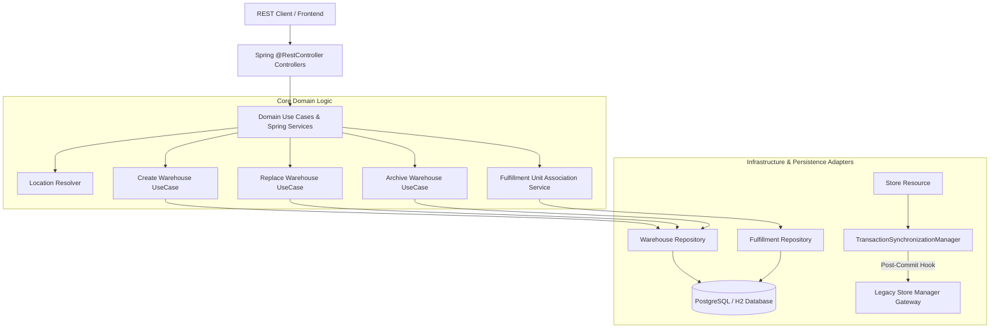

# Portfolio Showcase: Warehouse Colocation & Fulfillment System (Spring Boot 3)

> **A Production-Ready Enterprise Fulfillment & Warehouse Management Microservice built with Java 17, Spring Boot 3, Spring Web MVC, Spring Data JPA, Spring Transaction Management (Post-Commit Hooks), Hexagonal Architecture, OpenAPI 3.0, PostgreSQL, Docker, and AWS Free Tier CI/CD.**

---

## 🌟 Executive Summary

This project implements a high-performance **Warehouse Colocation & Fulfillment Management System**. Built on **Spring Boot 3** and **Hexagonal Architecture**, it manages geographic locations, warehouse units, retail store sync, and multi-tenant fulfillment unit associations.

### Key Highlights
- ⚡ **Spring Boot 3 Microservice**: Enterprise Spring Web MVC architecture running on Java 17.
- 🏗️ **Hexagonal Architecture (Ports & Adapters)**: Clean decoupling of business use cases, domain entities, REST adapters, and database persistence.
- 🔄 **Transactional Safety (Spring Post-Commit)**: Guarantees that legacy downstream synchronization (`LegacyStoreManagerGateway`) takes place **strictly after DB commit** via `TransactionSynchronizationManager.registerSynchronization`.
- 🏬 **Bonus Fulfillment Association Feature**: Multi-constraint assignment engine linking Warehouses, Products, and Stores with strict domain limits.
- ☁️ **AWS Free Tier Ready & GitHub Actions CI/CD**: Containerized with Docker and ready for immediate automated deployment to AWS App Runner or AWS ECS Fargate.

---

## 🛠️ Technology Stack

| Component | Technology | Description |
|---|---|---|
| **Framework** | Spring Boot 3.2.5 | Modern Spring Web MVC framework for enterprise microservices |
| **Language & SDK** | Java 17 | JDK 17+ with modern Stream API & pattern matching |
| **Architecture** | Hexagonal Architecture | Ports & Adapters pattern separating domain from infrastructure |
| **Database & ORM** | PostgreSQL / Spring Data JPA | Relational persistence with Spring Data Repositories |
| **API Contract** | OpenAPI 3.0 / Springdoc | Contract-first REST API generation & Swagger UI |
| **Containerization** | Docker / Docker Compose | Multi-stage lightweight Docker image builds |
| **Cloud Provider** | AWS (App Runner / ECS Fargate) | Cost-effective deployment on AWS Free Tier |
| **CI/CD Pipeline** | GitHub Actions | Automated lint, test, build, container push & deployment |

---

## 📐 Architecture & Domain Blueprint



---

## 📦 Domain Features & Validation Matrix

### 1. Location Gateway (`LocationResolver`)
- Resolves valid geographic locations (`AMSTERDAM-001`, `ZWOLLE-001`, etc.).
- Enforces location capacity limits (`maxNumberOfWarehouses` & `maxCapacity`).

### 2. Store Manager (`StoreResource`)
- Handles Store CRUD.
- **Transaction Safety**: Calls `LegacyStoreManagerGateway` **after Spring transaction commit** via `TransactionSynchronizationManager.registerSynchronization`.

### 3. Warehouse Management (`WarehouseResourceImpl` & Use Cases)
- **Create Warehouse**: Verifies Business Unit Code uniqueness, Location validity, maximum warehouse count per location, and total location capacity.
- **Replace Warehouse**: Archives existing active warehouse, maintains historical BU code, matches stock, and validates that new capacity accommodates existing inventory.
- **Archive Warehouse**: Soft-archives warehouse by setting `archivedAt` timestamp.
- **List/Get Warehouse**: Excludes archived warehouses, returning active units.

### 4. Bonus Task: Fulfillment Unit Assignment Engine
Associates Warehouses as fulfillment units for specific Products at target Stores with 3 strict domain constraints:
1. **Max 2 Warehouses per Product per Store**: A single product in a store can be fulfilled by at most 2 distinct warehouses.
2. **Max 3 Warehouses per Store**: A retail store can receive inventory from at most 3 distinct warehouses.
3. **Max 5 Product Types per Warehouse**: A warehouse can store/fulfill at most 5 distinct product SKUs.

---

## 🌐 API Reference Overview

| HTTP Method | Endpoint | Description | Status Codes |
|---|---|---|---|
| `GET` | `/warehouse` | List all active warehouse units | 200 |
| `POST` | `/warehouse` | Create new warehouse unit | 201, 400 |
| `GET` | `/warehouse/{id}` | Get warehouse unit by ID or BU Code | 200, 404 |
| `DELETE` | `/warehouse/{id}` | Archive warehouse unit by ID | 204, 404 |
| `POST` | `/warehouse/{code}/replacement` | Replace active warehouse unit | 200, 400, 404 |
| `GET` | `/store` | List all stores | 200 |
| `POST` | `/store` | Create store & sync with legacy system post-commit | 201, 422 |
| `GET` | `/fulfillment` | List all product-store-warehouse fulfillment links | 200 |
| `POST` | `/fulfillment` | Associate fulfillment unit with constraint validation | 201, 400, 404 |

---

## 🚀 How to Run Locally

### Prerequisites
- JDK 17+
- Maven 3.8+ (or `./mvnw`)
- Docker & Docker Compose (optional for DB stack)

### Quick Start
```bash
# 1. Clone & Navigate to project
git clone <your-repository-url>
cd fulfilment-service

# 2. Run unit and integration tests
./mvnw clean test

# 3. Launch application with Spring Boot
./mvnw spring-boot:run
```
Open Swagger UI: `http://localhost:8080/swagger-ui.html`

---

## ☁️ AWS Free Tier Deployment & CI/CD Setup

### Deploying with Docker Compose locally or on AWS EC2
```bash
docker-compose up --build -d
```

### GitHub Actions CI/CD Setup
1. Push repository to GitHub.
2. Configure GitHub Secrets (`AWS_ACCESS_KEY_ID`, `AWS_SECRET_ACCESS_KEY`, `AWS_ECR_ALIAS`, `AWS_APP_RUNNER_ARN`).
3. On every push to `main`, GitHub Actions runs tests, builds the Spring Boot Docker image, pushes it to AWS ECR, and triggers AWS App Runner / ECS deployment.
